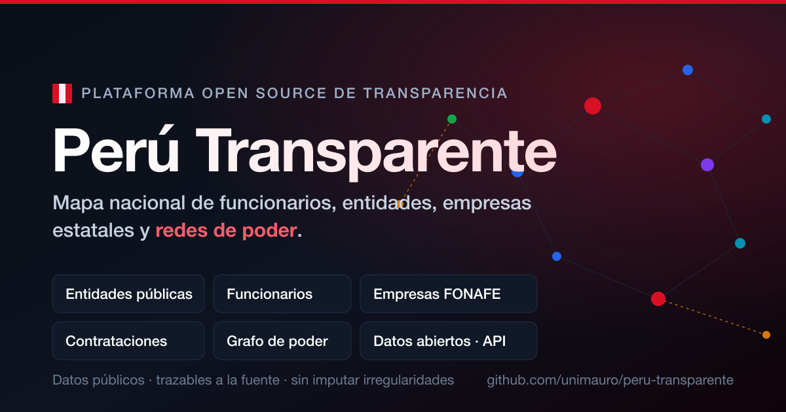

<div align="center">

# 🇵🇪 Perú Transparente

**Mapa Nacional de Funcionarios, Entidades Públicas, Empresas Estatales y Redes de Poder**

Plataforma open source de transparencia, datos abiertos y análisis de gestión pública del Estado peruano.



[](https://github.com/unimauro/peru-transparente/actions/workflows/deploy-pages.yml)
[](https://github.com/unimauro/peru-transparente/actions/workflows/ci.yml)
[](LICENSE)
[](https://creativecommons.org/licenses/by/4.0/)

</div>

---

## ¿Qué es?

**Perú Transparente** consolida información **pública** del Estado peruano (entidades, funcionarios, presupuestos, declaraciones juradas, empresas estatales y contrataciones) en una base de datos unificada, un **grafo nacional de poder** y un conjunto de dashboards y APIs abiertas.

El objetivo es construir el sistema de transparencia pública más completo del Perú, con datos **trazables a su fuente original**, exportables y analizables por periodistas, investigadores, academia, sociedad civil y la propia administración pública.

> ⚠️ **Principio rector — anti-overclaiming.** La plataforma **no afirma irregularidades**. Reúne, normaliza y vincula datos públicos. Toda inferencia (p. ej. posibles conflictos de interés) se marca explícitamente como *hipótesis derivada de datos*, con su nivel de confianza y fuente. Las conclusiones son del lector.

## Fuentes de datos

Gob.pe · Portal de Transparencia Estándar (PTE) · Contraloría · FONAFE · Ministerios y OPD · Gobiernos Regionales · Municipalidades · OSCE/OECE (contrataciones abiertas OCDS) · SUNARP · SMV · Datos Abiertos del Estado (datosabiertos.gob.pe) · MEF (Consulta Amigable / SIAF) · SERVIR · Congreso · JNE · ONPE · RENIEC (solo info pública) · Poder Judicial · Ministerio Público · SBS · BCRP.

Cada fuente tiene un *connector* documentado en [`docs/SCRAPING_STRATEGY.md`](docs/SCRAPING_STRATEGY.md) y un estado de implementación en el [roadmap](docs/ROADMAP.md).

## Arquitectura en una imagen

```
┌─────────────── INGESTA ───────────────┐   ┌──────── PROCESAMIENTO ────────┐   ┌──── SERVICIO ────┐
│ Scrapy + Playwright (connectors)       │   │ ETL Airflow → normalización    │   │ FastAPI REST     │
│ APIs OCDS / Datos Abiertos / SIAF      │──▶│ Entity Resolution (IA)         │──▶│ GraphQL          │
│ Detección de cambios + versionado      │   │ PostgreSQL (canónico)          │   │ Export CSV/JSON  │
└────────────────────────────────────────┘   │ Neo4j (grafo de poder)         │   │ Static JSON (CDN)│
                                              │ Redis (cache) · pgvector (IA)  │   └────────┬─────────┘
                                              └────────────────────────────────┘            │
                                                                                   ┌─────────▼─────────┐
                                                                                   │ Frontend React/Vite│
                                                                                   │ GitHub Pages (SPA) │
                                                                                   │ D3 · Cytoscape ·    │
                                                                                   │ ECharts · MapLibre  │
                                                                                   └────────────────────┘
```

Detalle completo en [`docs/ARCHITECTURE.md`](docs/ARCHITECTURE.md) y [`docs/INFRASTRUCTURE.md`](docs/INFRASTRUCTURE.md).

## Estrategia de despliegue gratuito / bajo costo

| Capa | Servicio | Plan |
|---|---|---|
| Frontend (SPA) | **GitHub Pages** | Gratis |
| Datos estáticos pre-renderizados | JSON/CSV versionados en repo + jsDelivr CDN | Gratis |
| API REST/GraphQL | **Fly.io** / Railway / Render (free-tier) o Cloud Run | Bajo costo |
| PostgreSQL + pgvector | **Supabase** / Neon (free-tier) | Gratis→ |
| Grafo | **Neo4j AuraDB Free** | Gratis (límite nodos) |
| Cache | **Upstash Redis** | Gratis |
| Scrapers programados | **GitHub Actions** (cron) | Gratis |
| Almacenamiento de PDFs/DJ | GitHub Releases / R2 Cloudflare | Gratis→ |

La idea: **el frontend y la mayoría de consultas se sirven como JSON estático generado por los scrapers** (modo "datos como código"), de modo que GitHub Pages basta para el 90% del tráfico. El backend dinámico solo se necesita para búsqueda semántica y exploración del grafo en vivo.

## Monorepo

```
peru-transparente/
├── backend/      FastAPI · API REST + GraphQL · servicios de grafo e IA
├── scrapers/     Scrapy + Playwright · un connector por fuente
├── etl/          DAGs de Airflow · normalización y carga
├── db/           Esquemas PostgreSQL + Cypher (Neo4j)
├── frontend/     React + TS + Vite + Tailwind · D3/Cytoscape/ECharts/MapLibre
├── data/         Datasets semilla y JSON estático publicado
├── docs/         Arquitectura, modelo de datos, roadmap, estrategias
├── scripts/      Utilidades de build y publicación de datos
└── .github/      CI/CD y scrapers programados
```

## Inicio rápido

```bash
# 1. Levantar todo el stack local (Postgres, Neo4j, Redis, API)
docker compose up -d

# 2. Backend (alternativa sin Docker)
cd backend && python -m venv .venv && source .venv/bin/activate
pip install -e ".[dev]"
uvicorn app.main:app --reload          # http://localhost:8000/docs

# 3. Frontend
cd frontend && npm install && npm run dev   # http://localhost:5173

# 4. Un scraper de prueba
cd scrapers && pip install -e . && scrapy crawl fonafe_empresas
```

## Documentación / Entregables

| Documento | Contenido |
|---|---|
| [ARCHITECTURE.md](docs/ARCHITECTURE.md) | Arquitectura completa del sistema |
| [DATA_MODEL.md](docs/DATA_MODEL.md) | Modelo de datos relacional + diccionario |
| [NEO4J_SCHEMA.md](docs/NEO4J_SCHEMA.md) | Esquema del grafo de poder (nodos, relaciones, Cypher) |
| [INFRASTRUCTURE.md](docs/INFRASTRUCTURE.md) | Diagrama de infraestructura y costos |
| [ROADMAP.md](docs/ROADMAP.md) | Roadmap de 12 meses |
| [MVP_90_DIAS.md](docs/MVP_90_DIAS.md) | Plan del MVP de 90 días |
| [SCRAPING_STRATEGY.md](docs/SCRAPING_STRATEGY.md) | Estrategia de scraping y actualización diaria |
| [DATA_QUALITY.md](docs/DATA_QUALITY.md) | Calidad de datos, trazabilidad y confianza |
| [SCALABILITY.md](docs/SCALABILITY.md) | Escalabilidad a 100k+ funcionarios y millones de registros |
| [UI_UX.md](docs/UI_UX.md) | Mockups de pantallas y guía de diseño |
| [CONTRIBUTING.md](CONTRIBUTING.md) | Cómo contribuir |

## Proyectos hermanos (deep-dives por empresa)

Perú Transparente ofrece la **vista de red y directorio** de cada empresa del Estado (FONAFE). Para el **análisis financiero y de gobierno corporativo en profundidad** de una empresa concreta, enlaza a observatorios especializados del mismo ecosistema:

| Empresa / dominio | Proyecto especializado | Estado |
|---|---|---|
| **Petroperú** | [**Petroperú Analytics**](https://github.com/unimauro/petroperu-analytics) · [demo](https://unimauro.github.io/petroperu-analytics/) — EE.FF. auditados, evolución financiera/operativa y de gobierno corporativo (terminal financiera estática y verificable). **Más completo** para Petroperú. | ✅ Activo |
| Empresas públicas (panorama FONAFE) | [Observatorio de Empresas Públicas del Perú](https://unimauro.github.io/observatorio-fonafe/) | ✅ Activo |

> En el perfil de **Petroperú** dentro de la plataforma, la sección *Estados financieros* deriva a Petroperú Analytics en lugar de duplicar el análisis. Ver `core.company.financials_ref`, que apunta al deep-dive externo cuando existe.

## Licencia

- **Código:** [AGPL-3.0](LICENSE) — garantiza que las mejoras vuelvan a la comunidad incluso en despliegues SaaS.
- **Datos:** [CC BY 4.0](https://creativecommons.org/licenses/by/4.0/) — atribución a las fuentes oficiales y a Perú Transparente.

## Aviso legal y ético

Se procesa exclusivamente **información de acceso público**. RENIEC y datos personales sensibles se limitan a lo expresamente público. Se respeta la Ley N.º 29733 (Protección de Datos Personales) y la Ley N.º 27806 (Transparencia y Acceso a la Información Pública). Ver [`docs/LEGAL.md`](docs/LEGAL.md).
