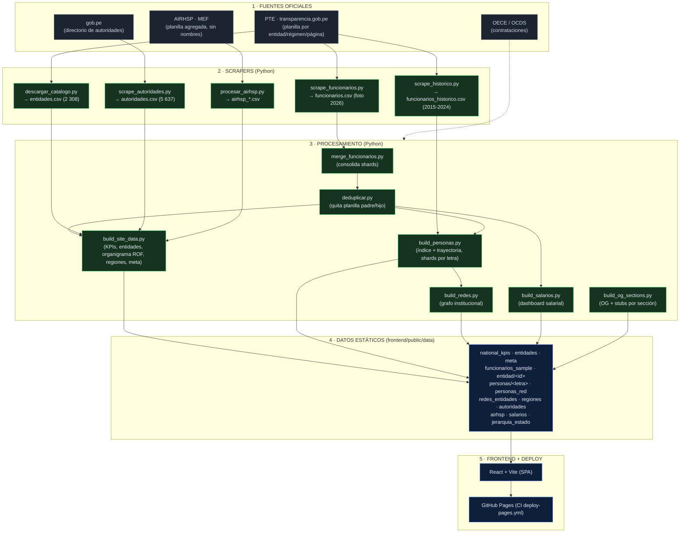

# Flujo del pipeline — Perú Transparente

Cómo fluye el dato desde las fuentes oficiales hasta el sitio. **Estático-primero**: los
scrapers producen CSV → unos scripts los convierten en JSON → el frontend (React) los lee
sin backend. Todo versionado en git y desplegado en GitHub Pages.



## Orden de ejecución (de cero a sitio)

| # | Comando | Produce |
|---|---|---|
| 1 | `python scripts/descargar_catalogo.py` | `data/entidades.csv` (universo 2 308, ordenado por prioridad) |
| 2 | `python scripts/scrape_funcionarios.py --ids-file data/entidades.csv --year 2026 --resume` | `data/funcionarios.csv` (planilla actual, nominal) |
| 3 | `python scripts/scrape_autoridades.py --resume` | `data/autoridades.csv` (rectores, ministros… de gob.pe) |
| 4 | `python scripts/scrape_historico.py --ids-file data/_con_datos.csv --years 2024,2021,2018,2015` | `data/funcionarios_historico.csv` (trayectorias) |
| 5 | `python scripts/procesar_airhsp.py` | `data/airhsp_*.csv` (cobertura total agregada del MEF) |
| 6 | `python scripts/merge_funcionarios.py` | consolida shards de workers en `funcionarios.csv` |
| 7 | `python scripts/deduplicar.py` | quita planillas duplicadas (entidad hijo = planilla del padre) |
| 8 | `python scripts/build_site_data.py` | KPIs, entidades, **organigrama por órganos (ROF)**, regiones, autoridades, airhsp, meta |
| 9 | `python scripts/build_personas.py` | índice de personas + **trayectoria** (shards por letra) |
| 10 | `python scripts/build_redes.py` | grafo institucional (entidades unidas por personas) |
| 11 | `python scripts/build_salarios.py` | `salarios.json` (distribución, top, por régimen) |
| 12 | `python scripts/build_og_sections.py` | imágenes OG + stubs HTML por sección |
| 13 | `cd frontend && npm run build` | `dist/` (SPA) |
| 14 | `git push` → CI `deploy-pages.yml` | publica en GitHub Pages |

## Ideas clave del diseño
- **Idempotencia y resumible:** cada scraper tiene checkpoint (`.checkpoint.json`); re-ejecutar continúa donde quedó.
- **Dedup honesto:** algunas entidades del PTE devuelven la planilla de su "padre" → se detectan por huella y se marcan "planilla compartida".
- **Estático-primero:** el 100% del sitio se sirve como JSON desde Pages (sin servidor). El CSV completo se versiona comprimido (`.gz`).
- **Anti-overclaiming:** todo dato lleva su fuente; las inferencias (vínculos por nombre) se marcan como hipótesis, no afirmaciones.

## Hacia la base de datos (siguiente fase)
El esquema y el cargador ya están listos en [`db/supabase/schema.sql`](../db/supabase/schema.sql) y
[`scripts/load_supabase.py`](../scripts/load_supabase.py): con la cadena de conexión, se cargan
`entidades` + `funcionarios` + `autoridades` y queda la función `buscar_persona()` (full-text + fuzzy).
Eso reemplaza los JSON grandes (~256 MB hoy) por consultas en vivo.
```
fuentes → scrapers (CSV) → [Postgres/Supabase] → API → frontend
                                ↑ aquí entra la BD, sustituyendo los JSON estáticos pesados
```
