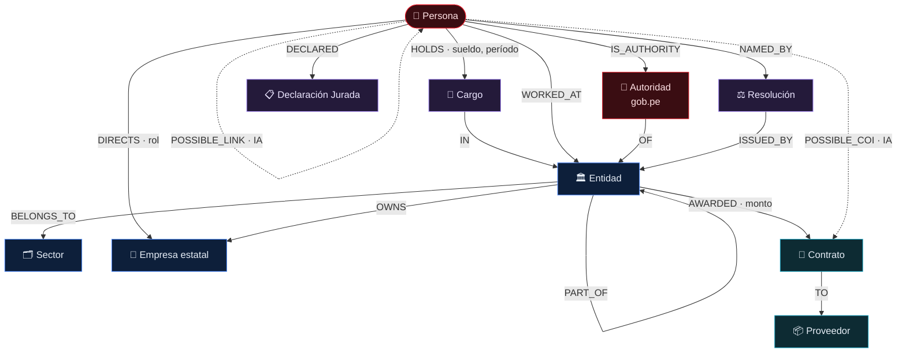

# Esquema del Grafo de Poder — Neo4j

El grafo es **derivado** de PostgreSQL (vía CDC). Modela las redes de poder para exploración visual tipo OpenCorporates / Aleph (OCCRP) / Poderopedia.

> **Modelo normalizado, sin duplicar data:** cada Persona, Entidad o Cargo es **un único nodo**; las relaciones solo lo referencian. Una persona con 3 cargos = 1 nodo `:Person` + 3 aristas `HOLDS` (no 3 copias de la persona). El grafo no es fuente de verdad: se reconstruye 100% desde PostgreSQL.

## 0. El modelo en una imagen

> ── sólido = dato verificado (de fuente) · ┈ punteado = hipótesis inferida por IA (anti-overclaiming)



## 1. Nodos (labels)

| Label | Propiedades clave | Origen |
|---|---|---|
| `:Person` | `id, name, normalizedName, canonicalKey` | core.person |
| `:Entity` | `id, name, acronym, level, sectorId, ruc` | core.entity |
| `:Sector` | `id, name` | core.sector |
| `:Position` | `id, title, hierarchyLevel, regime` | core.position |
| `:Company` | `id, name, ruc, fonafeClass` | core.company |
| `:Supplier` | `id, name, ruc, isStateOwned` | core.supplier |
| `:Contract` | `id, ocid, amount, currency, signDate` | core.contract |
| `:Declaration` | `id, period, assetsTotal, incomeTotal` | core.asset_declaration |
| `:Resolution` | `id, number, date, url, type` | resoluciones de designación/cese |

Cada nodo lleva además `confidence`, `source`, `capturedAt`.

## 2. Relaciones

```
(:Person)-[:HOLDS {start, end, status, remuneration}]->(:Position)
(:Position)-[:IN]->(:Entity)
(:Person)-[:WORKED_AT {start, end}]->(:Entity)        // proyección directa para consultas rápidas
(:Person)-[:DIRECTS {role, start, end}]->(:Company)
(:Person)-[:OWNS_ROLE_IN]->(:Supplier)                // persona vinculada a proveedor
(:Person)-[:DECLARED]->(:Declaration)
(:Person)-[:NAMED_BY]->(:Resolution)
(:Resolution)-[:ISSUED_BY]->(:Entity)
(:Entity)-[:BELONGS_TO]->(:Sector)
(:Entity)-[:PART_OF]->(:Entity)                       // jerarquía / organigrama
(:Entity)-[:OWNS]->(:Company)
(:Entity)-[:AWARDED {amount, date}]->(:Contract)
(:Contract)-[:TO]->(:Supplier)
(:Company)-[:SIGNED]->(:Contract)
(:Person)-[:POSSIBLE_LINK {type, confidence, evidence}]->(:Person)   // inferencia IA (hipótesis)
(:Person)-[:POSSIBLE_COI {confidence, evidence}]->(:Contract)        // posible conflicto de interés (hipótesis)
```

> Las relaciones `POSSIBLE_*` son **hipótesis derivadas por IA**, nunca afirmaciones. Llevan `confidence` y `evidence` (lista de IDs/URLs que las sustentan).

## 3. Constraints e índices

```cypher
CREATE CONSTRAINT person_id   IF NOT EXISTS FOR (p:Person)   REQUIRE p.id IS UNIQUE;
CREATE CONSTRAINT entity_id   IF NOT EXISTS FOR (e:Entity)   REQUIRE e.id IS UNIQUE;
CREATE CONSTRAINT company_id  IF NOT EXISTS FOR (c:Company)  REQUIRE c.id IS UNIQUE;
CREATE CONSTRAINT supplier_id IF NOT EXISTS FOR (s:Supplier) REQUIRE s.id IS UNIQUE;
CREATE CONSTRAINT contract_id IF NOT EXISTS FOR (k:Contract) REQUIRE k.id IS UNIQUE;

CREATE INDEX person_name   IF NOT EXISTS FOR (p:Person) ON (p.normalizedName);
CREATE INDEX entity_ruc    IF NOT EXISTS FOR (e:Entity) ON (e.ruc);
CREATE INDEX supplier_ruc  IF NOT EXISTS FOR (s:Supplier) ON (s.ruc);
```

## 4. Consultas de ejemplo

**Vecindario de una persona (2 saltos) para la vista de grafo:**
```cypher
MATCH path = (p:Person {id: $id})-[*1..2]-(n)
RETURN path LIMIT 300;
```

**Ruta de poder entre dos personas (¿cómo se conectan?):**
```cypher
MATCH p = shortestPath((a:Person {id:$a})-[*..6]-(b:Person {id:$b}))
RETURN p;
```

**Funcionarios que pasaron por la misma entidad y hoy dirigen proveedores del Estado:**
```cypher
MATCH (s:Supplier)<-[:OWNS_ROLE_IN]-(p:Person)-[:WORKED_AT]->(e:Entity)-[:AWARDED]->(:Contract)-[:TO]->(s)
RETURN p, e, s LIMIT 100;
```

**Personas con más cargos públicos distintos (centralidad de carrera):**
```cypher
MATCH (p:Person)-[:HOLDS]->(pos:Position)
RETURN p.name, count(DISTINCT pos) AS cargos
ORDER BY cargos DESC LIMIT 50;
```

## 5. Sincronización Postgres → Neo4j
- CDC con triggers/`logical replication` o batch nocturno (`etl/dags/project_graph.py`).
- Upsert idempotente con `MERGE` por `id`.
- El grafo se puede reconstruir 100% desde Postgres en cualquier momento (`scripts/rebuild_graph.py`).
